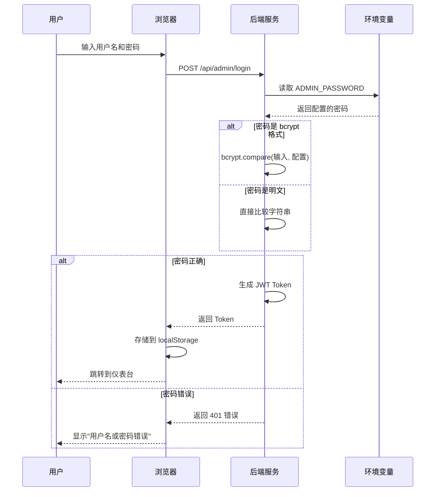

# 后台管理系统登录说明

## 🔐 当前登录信息

**访问地址**: https://visitor.timehuasun.cn:8021/

**用户名**: `admin`  
**密码**: `admin123`

---

## ⚠️ 重要提示

### 密码已重置

由于之前配置的是 bcrypt 加密的密码，现已重置为明文密码 `admin123`。

**建议**: 首次登录后立即修改密码！

---

## 🛠️ 如何修改密码

### 方法1：通过管理后台（推荐）

1. 登录管理后台
2. 点击右上角用户名
3. 选择"修改密码"
4. 输入旧密码和新密码
5. 点击"确认修改"

### 方法2：通过服务器命令行

```bash
# SSH 登录服务器
ssh visitor

# 生成新的 bcrypt 密码哈希
cd /home/node/visitor/auto-deploy/current/backend
node -e "const bcrypt = require('bcrypt'); bcrypt.hash('新密码', 10).then(hash => console.log(hash));"

# 复制输出的哈希值，编辑 .env 文件
vi .env

# 修改这一行（将 YOUR_HASH 替换为上一步生成的哈希值）
ADMIN_PASSWORD=$2a$10$YOUR_HASH_HERE

# 保存退出后重启服务
pkill -9 node
sleep 2
nohup node src/index.js >> backend.log 2>&1 &
```

### 方法3：直接修改为明文密码（不推荐生产环境）

```bash
# SSH 登录服务器
ssh visitor

# 编辑配置文件
vi /home/node/visitor/auto-deploy/current/backend/.env

# 修改密码（明文）
ADMIN_PASSWORD=your_new_password

# 重启服务
pkill -9 node
sleep 2
cd /home/node/visitor/auto-deploy/current/backend
nohup node src/index.js >> backend.log 2>&1 &
```

---

## 🔒 密码安全建议

### 生产环境最佳实践

1. **使用强密码**
   - 至少 12 位
   - 包含大小写字母、数字、特殊字符
   - 示例: `V1s1t0r@2026#Secure!`

2. **使用 bcrypt 加密**
   ```bash
   # 生成加密密码
   node -e "const bcrypt = require('bcrypt'); bcrypt.hash('YourStrongPassword123!', 10).then(console.log);"
   
   # 输出类似：$2a$10$Skw0ZSAJsCs8tCDuZcKen.9vV/sGQhmVAzEoQho5iX1cqPPgvzBVK
   ```

3. **定期更换密码**
   - 建议每 3-6 个月更换一次
   - 不要重复使用旧密码

4. **不要共享密码**
   - 每个管理员使用独立账号
   - 离职员工立即禁用账号

5. **启用双因素认证（未来功能）**
   - 短信验证码
   - Google Authenticator

---

## 🐛 常见问题

### Q1: 忘记密码怎么办？

**解决方案**:
```bash
# SSH 登录服务器
ssh visitor

# 重置为默认密码
cd /home/node/visitor/auto-deploy/current/backend
sed -i 's/^ADMIN_PASSWORD=.*/ADMIN_PASSWORD=admin123/' .env

# 重启服务
pkill -9 node && sleep 2 && nohup node src/index.js >> backend.log 2>&1 &

# 使用 admin/admin123 登录
```

### Q2: 提示"用户名或密码错误"？

**可能原因**:
1. 密码确实错误
2. 浏览器自动填充了旧密码
3. Caps Lock 大写锁定开启

**解决方法**:
1. 清除浏览器缓存和Cookie
2. 手动输入密码（不要自动填充）
3. 检查大小写
4. 重置密码（见Q1）

### Q3: 登录后立即被踢出？

**可能原因**:
1. Token 过期
2. 多个设备同时登录
3. JWT_SECRET 被修改

**解决方法**:
1. 清除浏览器 localStorage
2. 重新登录
3. 检查服务器日志：
   ```bash
   ssh visitor "tail -50 /home/node/visitor/auto-deploy/current/backend/backend.log | grep -i 'token\|jwt'"
   ```

### Q4: 如何查看登录日志？

```bash
# 查看最近的登录记录
ssh visitor "grep '管理员登录' /home/node/visitor/auto-deploy/current/backend/backend.log | tail -20"

# 查看失败的登录尝试
ssh visitor "grep '登录失败' /home/node/visitor/auto-deploy/current/backend/backend.log | tail -20"
```

---

## 📊 登录流程



---

## 🔧 技术细节

### 密码验证逻辑

后端支持两种密码格式：

1. **bcrypt 加密**（推荐）
   ```javascript
   if (configuredPassword.startsWith('$2b$')) {
     isValidPassword = await bcrypt.compare(password, configuredPassword);
   }
   ```

2. **明文密码**（向后兼容）
   ```javascript
   else {
     isValidPassword = (password === configuredPassword);
   }
   ```

### JWT Token 配置

```javascript
// 配置文件: backend/src/config/index.js
jwt: {
  secret: process.env.JWT_SECRET || 'your-secret-key-change-in-production',
  expiresIn: '7d'  // Token 有效期 7 天
}
```

**注意**: 生产环境必须修改 `JWT_SECRET`！

---

## ✅ 安全检查清单

每次修改密码后请确认：

- [ ] 新密码符合复杂度要求
- [ ] 能够成功登录
- [ ] 旧密码无法登录
- [ ] Token 正常生成
- [ ] 日志中无异常错误
- [ ] 其他管理员知晓新密码（如果需要）
- [ ] 已更新密码管理文档

---

## 📞 紧急联系

如果无法登录且无法自行解决：

1. **SSH 登录服务器**
   ```bash
   ssh visitor
   ```

2. **重置密码**
   ```bash
   cd /home/node/visitor/auto-deploy/current/backend
   sed -i 's/^ADMIN_PASSWORD=.*/ADMIN_PASSWORD=admin123/' .env
   pkill -9 node && sleep 2 && nohup node src/index.js >> backend.log 2>&1 &
   ```

3. **使用默认密码登录**
   - 用户名: `admin`
   - 密码: `admin123`

4. **立即修改密码**

---

**文档版本**: v1.0  
**最后更新**: 2026-04-07  
**密码状态**: ✅ 已重置为 admin123
