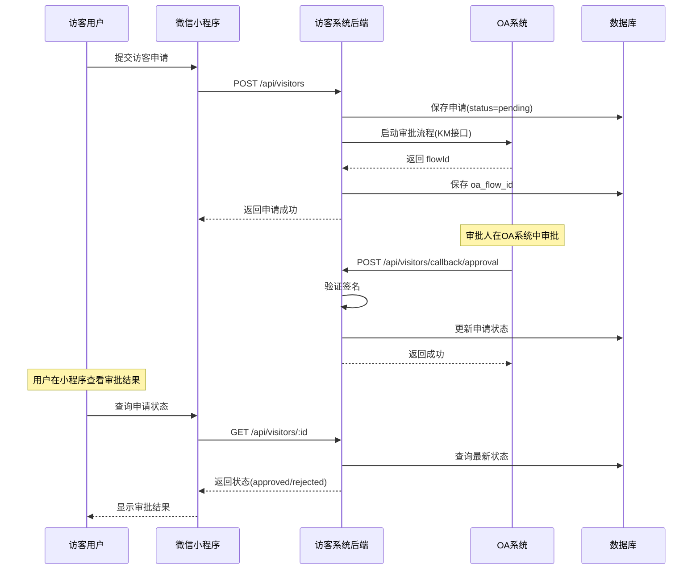

# OA 审批回调接口调用示例

## 📋 接口信息

**接口地址**: `POST https://visitor.timehuasun.cn:8021/api/visitors/callback/approval`

**用途**: OA系统审批完成后，调用此接口通知访客系统更新申请状态

---

## 🔐 认证方式

### 方式1：HTTP Header（推荐）
```http
X-OA-Signature: {签名值}
```

### 方式2：请求体参数
```json
{
  "sign": "{签名值}"
}
```

---

## 📤 请求示例

### 示例1：审批通过

```bash
curl -X POST https://visitor.timehuasun.cn:8021/api/visitors/callback/approval \
  -H "Content-Type: application/json" \
  -H "X-OA-Signature: abc123signature" \
  -d '{
    "applicationId": "8c0f0d47-b1ea-4cc6-bf9b-93eb00312662",
    "oaFlowId": "KM_FLOW_20260407_001",
    "status": "approved",
    "approvalTime": "2026-04-07 14:30:00",
    "approverName": "张三",
    "approverPhone": "13800138000",
    "sign": "abc123signature"
  }'
```

### 示例2：审批拒绝

```bash
curl -X POST https://visitor.timehuasun.cn:8021/api/visitors/callback/approval \
  -H "Content-Type: application/json" \
  -H "X-OA-Signature: xyz789signature" \
  -d '{
    "applicationId": "8c0f0d47-b1ea-4cc6-bf9b-93eb00312662",
    "oaFlowId": "KM_FLOW_20260407_001",
    "status": "rejected",
    "approvalTime": "2026-04-07 15:00:00",
    "rejectReason": "来访时间冲突，请重新预约",
    "approverName": "李四",
    "approverPhone": "13900139000",
    "sign": "xyz789signature"
  }'
```

### 示例3：只传 oaFlowId（不传 applicationId）

```bash
curl -X POST https://visitor.timehuasun.cn:8021/api/visitors/callback/approval \
  -H "Content-Type: application/json" \
  -H "X-OA-Signature: abc456signature" \
  -d '{
    "oaFlowId": "KM_FLOW_20260407_001",
    "status": "approved",
    "approvalTime": "2026-04-07 14:30:00",
    "approverName": "王五",
    "approverPhone": "13700137000",
    "sign": "abc456signature"
  }'
```

**说明**: 
- 后端会自动通过 `oaFlowId` 查询数据库找到对应的申请记录
- 如果找不到对应的申请，会返回 404 错误
- 这种方式适用于 OA 系统只知道流程 ID 的场景

### 示例4：使用 Python 调用

```python
import requests
import hashlib
import time

def generate_signature(data, secret_key="your_secret_key"):
    """生成签名"""
    # 按key排序后拼接
    sorted_keys = sorted(data.keys())
    sign_str = "&".join([f"{k}={data[k]}" for k in sorted_keys if k != 'sign'])
    sign_str += f"&key={secret_key}"
    
    # MD5加密
    return hashlib.md5(sign_str.encode('utf-8')).hexdigest()

# 准备数据
callback_data = {
    "applicationId": "8c0f0d47-b1ea-4cc6-bf9b-93eb00312662",
    "oaFlowId": "KM_FLOW_20260407_001",
    "status": "approved",
    "approvalTime": "2026-04-07 14:30:00",
    "approverName": "张三",
    "approverPhone": "13800138000"
}

# 生成签名
signature = generate_signature(callback_data)
callback_data["sign"] = signature

# 发送请求
response = requests.post(
    "https://visitor.timehuasun.cn:8021/api/visitors/callback/approval",
    json=callback_data,
    headers={"X-OA-Signature": signature}
)

print(response.json())
```

### 示例5：使用 Java 调用

```java
import org.apache.http.client.methods.CloseableHttpResponse;
import org.apache.http.client.methods.HttpPost;
import org.apache.http.entity.StringEntity;
import org.apache.http.impl.client.CloseableHttpClient;
import org.apache.http.impl.client.HttpClients;
import com.google.gson.Gson;
import java.util.HashMap;
import java.util.Map;

public class OACallbackExample {
    
    public static void main(String[] args) throws Exception {
        // 准备回调数据
        Map<String, Object> callbackData = new HashMap<>();
        callbackData.put("applicationId", "8c0f0d47-b1ea-4cc6-bf9b-93eb00312662");
        callbackData.put("oaFlowId", "KM_FLOW_20260407_001");
        callbackData.put("status", "approved");
        callbackData.put("approvalTime", "2026-04-07 14:30:00");
        callbackData.put("approverName", "张三");
        callbackData.put("approverPhone", "13800138000");
        
        // 生成签名（简化示例，实际应使用安全算法）
        String signature = generateSignature(callbackData);
        callbackData.put("sign", signature);
        
        // 发送HTTP请求
        CloseableHttpClient httpClient = HttpClients.createDefault();
        HttpPost httpPost = new HttpPost(
            "https://visitor.timehuasun.cn:8021/api/visitors/callback/approval"
        );
        
        httpPost.setHeader("Content-Type", "application/json");
        httpPost.setHeader("X-OA-Signature", signature);
        
        Gson gson = new Gson();
        String jsonBody = gson.toJson(callbackData);
        httpPost.setEntity(new StringEntity(jsonBody, "UTF-8"));
        
        try (CloseableHttpResponse response = httpClient.execute(httpPost)) {
            System.out.println("Status: " + response.getStatusLine().getStatusCode());
        }
    }
    
    private static String generateSignature(Map<String, Object> data) {
        // TODO: 实现签名算法
        return "signature";
    }
}
```

---

## 📥 响应示例

### 成功响应

```json
{
  "code": 0,
  "message": "回调处理成功"
}
```

### 失败响应

#### 缺少签名
```json
{
  "code": 400,
  "message": "缺少签名参数"
}
```

#### 签名验证失败
```json
{
  "code": 400,
  "message": "签名验证失败"
}
```

#### 服务器错误
```json
{
  "code": 500,
  "message": "回调处理失败",
  "error": "具体错误信息"
}
```

---

## 📝 参数说明

### 请求参数

| 参数名 | 类型 | 必填 | 说明 |
|--------|------|------|------|
| applicationId | string | ❌ | 访客申请ID（UUID格式），**或提供 oaFlowId** |
| oaFlowId | string | ✅ | OA流程ID，**如果没传 applicationId，必须提供此字段** |
| status | string | ✅ | 审批状态：`approved` 或 `rejected` |
| approvalTime | string | ✅ | 审批时间，格式：`YYYY-MM-DD HH:mm:ss` |
| rejectReason | string | ❌ | 拒绝原因（仅当 status=rejected 时必填） |
| approverName | string | ❌ | 审批人姓名 |
| approverPhone | string | ❌ | 审批人手机号 |
| sign | string | ✅ | 签名（用于验证请求合法性） |

### 参数组合规则

**方式1：使用 applicationId（推荐）**
```json
{
  "applicationId": "8c0f0d47-b1ea-4cc6-bf9b-93eb00312662",
  "oaFlowId": "KM_FLOW_20260407_001",
  "status": "approved",
  ...
}
```

**方式2：只使用 oaFlowId**
```json
{
  "oaFlowId": "KM_FLOW_20260407_001",
  "status": "approved",
  ...
}
```

后端会自动通过 `oaFlowId` 查找对应的申请记录。

**注意**: 
- 至少需要提供 `applicationId` **或** `oaFlowId` 中的一个
- 如果两者都提供，优先使用 `applicationId`
- 如果只提供 `oaFlowId`，系统会查询数据库找到对应的申请

### 响应参数

| 参数名 | 类型 | 说明 |
|--------|------|------|
| code | number | 状态码：0=成功，其他=失败 |
| message | string | 响应消息 |
| error | string | 错误详情（仅失败时返回） |

---

## 🔒 签名算法

### 签名步骤

1. **提取参数**：排除 `sign` 字段
2. **排序**：按参数名的字典序排序
3. **拼接**：格式为 `key1=value1&key2=value2&key=SECRET_KEY`
4. **加密**：对拼接字符串进行 MD5 加密
5. **转小写**：将MD5结果转为小写

### 签名示例

```javascript
// 原始数据
const data = {
  applicationId: "8c0f0d47-b1ea-4cc6-bf9b-93eb00312662",
  oaFlowId: "KM_FLOW_20260407_001",
  status: "approved",
  approvalTime: "2026-04-07 14:30:00"
};

// 1. 排除 sign，按key排序
const sortedKeys = Object.keys(data).sort();
// ['applicationId', 'approvalTime', 'oaFlowId', 'status']

// 2. 拼接字符串
const signStr = sortedKeys
  .map(key => `${key}=${data[key]}`)
  .join('&') + '&key=YOUR_SECRET_KEY';
// "applicationId=8c0f0d47...&approvalTime=2026-04-07...&oaFlowId=KM_FLOW...&status=approved&key=YOUR_SECRET_KEY"

// 3. MD5加密
const signature = md5(signStr).toLowerCase();
```

**注意**: 
- 开发环境可以暂时跳过签名验证
- 生产环境必须启用签名验证
- SECRET_KEY 应该通过环境变量配置

---

## 🔄 业务流程



---

## ⚠️ 注意事项

### 1. 幂等性
- OA系统可能会重复调用回调接口
- 后端会多次更新同一记录，但结果一致
- 建议OA系统做好重试控制

### 2. 超时处理
- 回调接口应该在 **5秒内** 响应
- 如果超时，OA系统应该重试
- 最多重试 **3次**

### 3. 错误处理
- 如果回调失败，OA系统应该记录日志
- 可以通过管理后台手动更新状态
- 或者提供人工补偿机制

### 4. 时间格式
- 统一使用 **北京时间**（UTC+8）
- 格式：`YYYY-MM-DD HH:mm:ss`
- 示例：`2026-04-07 14:30:00`

### 5. 状态映射

| OA系统状态 | 访客系统状态 | 说明 |
|-----------|-------------|------|
| approved | approved | 审批通过 |
| rejected | rejected | 审批拒绝 |
| pending | pending | 待审批（不需要回调） |

---

## 🧪 测试方法

### 1. 使用 Postman 测试

```
POST https://visitor.timehuasun.cn:8021/api/visitors/callback/approval

Headers:
  Content-Type: application/json
  X-OA-Signature: test_signature

Body (raw JSON):
{
  "applicationId": "8c0f0d47-b1ea-4cc6-bf9b-93eb00312662",
  "oaFlowId": "TEST_FLOW_001",
  "status": "approved",
  "approvalTime": "2026-04-07 14:30:00",
  "approverName": "测试审批人",
  "approverPhone": "13800138000",
  "sign": "test_signature"
}
```

### 2. 查看后端日志

```bash
# SSH 登录服务器
ssh visitor

# 查看实时日志
tail -f /home/node/visitor/auto-deploy/current/backend/backend.log | grep "OA 回调"
```

**期望日志**:
```
📥 收到 OA 回调请求: {...}
✅ 回调签名验证通过（开发环境跳过）
✅ OA 回调处理完成，申请 xxx 状态已更新为 approved
```

### 3. 验证数据库

```sql
-- 登录数据库
mysql -u root -p visitor_system

-- 查询申请状态
SELECT id, name, status, approval_time, reject_reason, oa_flow_id 
FROM visitor_applications 
WHERE id = '8c0f0d47-b1ea-4cc6-bf9b-93eb00312662';
```

**期望结果**:
```
+--------------------------------------+--------+----------+---------------------+---------------+---------------------+
| id                                   | name   | status   | approval_time       | reject_reason | oa_flow_id          |
+--------------------------------------+--------+----------+---------------------+---------------+---------------------+
| 8c0f0d47-b1ea-4cc6-bf9b-93eb00312662 | 张三   | approved | 2026-04-07 14:30:00 | NULL          | KM_FLOW_20260407_001|
+--------------------------------------+--------+----------+---------------------+---------------+---------------------+
```

---

## 📞 技术支持

如有问题，请联系：
- **项目负责人**: [填写负责人]
- **技术支持邮箱**: [填写邮箱]
- **文档版本**: v1.0
- **最后更新**: 2026-04-07
