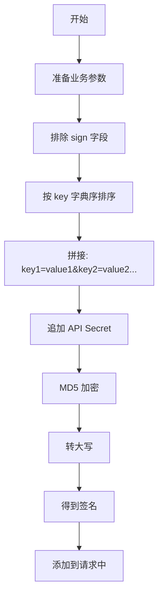

# OA 接口签名规则详解

## 📋 签名算法概述

本项目使用 **MD5 签名算法**，确保请求的完整性和合法性。

---

## 🔐 签名生成步骤

### 步骤1：准备参数

排除 `sign` 字段本身，保留所有其他业务参数。

```javascript
const data = {
  applicationId: "8c0f0d47-b1ea-4cc6-bf9b-93eb00312662",
  oaFlowId: "KM_FLOW_20260407_001",
  status: "approved",
  approvalTime: "2026-04-07 14:30:00"
};
```

### 步骤2：参数排序

将所有参数的 key 按**字典序（ASCII码）升序排列**。

```javascript
const sortedKeys = Object.keys(data).sort();
// 结果：['applicationId', 'approvalTime', 'oaFlowId', 'status']
```

### 步骤3：拼接字符串

格式：`key1=value1&key2=value2&key3=value3...`

```javascript
const str = sortedKeys.map(key => `${key}=${data[key]}`).join('&');
// 结果："applicationId=8c0f0d47-b1ea-4cc6-bf9b-93eb00312662&approvalTime=2026-04-07 14:30:00&oaFlowId=KM_FLOW_20260407_001&status=approved"
```

### 步骤4：添加密钥

在拼接字符串末尾追加 **API Secret**（从环境变量 `OA_API_SECRET` 获取）。

```javascript
const secret = process.env.OA_API_SECRET; // 例如："your_secret_key_123"
const signStr = str + secret;
// 结果："applicationId=...&approvalTime=...&oaFlowId=...&status=approvedyour_secret_key_123"
```

### 步骤5：MD5 加密

对最终字符串进行 MD5 哈希计算。

```javascript
const crypto = require('crypto');
const signature = crypto.createHash('md5').update(signStr).digest('hex');
// 结果："a1b2c3d4e5f6..." (32位小写十六进制)
```

### 步骤6：转大写（可选）

根据配置，可能需要将签名转为大写。

```javascript
const finalSignature = signature.toUpperCase();
// 结果："A1B2C3D4E5F6..."
```

---

## 💻 代码实现

### Node.js 实现

```javascript
const crypto = require('crypto');

/**
 * 生成签名
 * @param {Object} data - 需要签名的数据（不包含 sign 字段）
 * @param {string} apiSecret - API 密钥
 * @returns {string} 签名值（大写）
 */
function generateSign(data, apiSecret) {
  // 1. 提取并排序 key
  const sortedKeys = Object.keys(data).sort();
  
  // 2. 拼接字符串
  const str = sortedKeys.map(key => `${key}=${data[key]}`).join('&');
  
  // 3. 添加密钥
  const signStr = str + apiSecret;
  
  // 4. MD5 加密并转大写
  return crypto.createHash('md5').update(signStr).digest('hex').toUpperCase();
}

// 使用示例
const callbackData = {
  applicationId: "8c0f0d47-b1ea-4cc6-bf9b-93eb00312662",
  oaFlowId: "KM_FLOW_20260407_001",
  status: "approved",
  approvalTime: "2026-04-07 14:30:00"
};

const apiSecret = "your_secret_key_123";
const sign = generateSign(callbackData, apiSecret);

console.log("签名:", sign);
```

### Python 实现

```python
import hashlib

def generate_sign(data, api_secret):
    """
    生成签名
    :param data: 需要签名的数据（字典，不包含 sign 字段）
    :param api_secret: API 密钥
    :return: 签名值（大写）
    """
    # 1. 按 key 排序
    sorted_keys = sorted(data.keys())
    
    # 2. 拼接字符串
    sign_str = "&".join([f"{key}={data[key]}" for key in sorted_keys])
    
    # 3. 添加密钥
    sign_str += api_secret
    
    # 4. MD5 加密并转大写
    signature = hashlib.md5(sign_str.encode('utf-8')).hexdigest().upper()
    
    return signature

# 使用示例
callback_data = {
    "applicationId": "8c0f0d47-b1ea-4cc6-bf9b-93eb00312662",
    "oaFlowId": "KM_FLOW_20260407_001",
    "status": "approved",
    "approvalTime": "2026-04-07 14:30:00"
}

api_secret = "your_secret_key_123"
sign = generate_sign(callback_data, api_secret)

print(f"签名: {sign}")
```

### Java 实现

```java
import java.security.MessageDigest;
import java.util.TreeMap;
import java.util.Map;

public class SignUtils {
    
    /**
     * 生成签名
     * @param data 需要签名的数据
     * @param apiSecret API 密钥
     * @return 签名值（大写）
     */
    public static String generateSign(Map<String, Object> data, String apiSecret) {
        try {
            // 1. 使用 TreeMap 自动排序
            TreeMap<String, Object> sortedMap = new TreeMap<>(data);
            
            // 2. 拼接字符串
            StringBuilder sb = new StringBuilder();
            for (Map.Entry<String, Object> entry : sortedMap.entrySet()) {
                if (sb.length() > 0) {
                    sb.append("&");
                }
                sb.append(entry.getKey()).append("=").append(entry.getValue());
            }
            
            // 3. 添加密钥
            sb.append(apiSecret);
            
            // 4. MD5 加密
            MessageDigest md = MessageDigest.getInstance("MD5");
            byte[] digest = md.digest(sb.toString().getBytes("UTF-8"));
            
            // 5. 转十六进制字符串（大写）
            StringBuilder hexString = new StringBuilder();
            for (byte b : digest) {
                String hex = Integer.toHexString(0xff & b);
                if (hex.length() == 1) {
                    hexString.append('0');
                }
                hexString.append(hex);
            }
            
            return hexString.toString().toUpperCase();
        } catch (Exception e) {
            throw new RuntimeException("签名生成失败", e);
        }
    }
    
    public static void main(String[] args) {
        Map<String, Object> data = new TreeMap<>();
        data.put("applicationId", "8c0f0d47-b1ea-4cc6-bf9b-93eb00312662");
        data.put("oaFlowId", "KM_FLOW_20260407_001");
        data.put("status", "approved");
        data.put("approvalTime", "2026-04-07 14:30:00");
        
        String apiSecret = "your_secret_key_123";
        String sign = generateSign(data, apiSecret);
        
        System.out.println("签名: " + sign);
    }
}
```

---

## ✅ 签名验证

### 服务端验证流程

```javascript
/**
 * 验证 OA 回调的签名
 * @param {Object} params - 回调参数（包含 sign）
 * @param {string} signature - 收到的签名值
 * @returns {boolean} 验证是否通过
 */
function verifyCallbackSignature(params, signature) {
  // 1. 排除 sign 字段
  const { sign, ...data } = params;
  
  // 2. 重新计算签名
  const expectedSign = generateSign(data, apiSecret);
  
  // 3. 比较签名（不区分大小写）
  return expectedSign.toLowerCase() === signature.toLowerCase();
}
```

### 验证示例

```javascript
// 收到的请求
const request = {
  body: {
    applicationId: "8c0f0d47-b1ea-4cc6-bf9b-93eb00312662",
    oaFlowId: "KM_FLOW_20260407_001",
    status: "approved",
    approvalTime: "2026-04-07 14:30:00",
    sign: "A1B2C3D4E5F6..."  // OA 系统传来的签名
  },
  headers: {
    'x-oa-signature': 'A1B2C3D4E5F6...'  // 或者从 Header 中获取
  }
};

// 验证签名
const signature = request.headers['x-oa-signature'] || request.body.sign;
const isValid = verifyCallbackSignature(request.body, signature);

if (isValid) {
  console.log("✅ 签名验证通过");
} else {
  console.log("❌ 签名验证失败");
}
```

---

## 🧪 测试用例

### 测试数据

```javascript
const testData = {
  applicationId: "8c0f0d47-b1ea-4cc6-bf9b-93eb00312662",
  oaFlowId: "KM_FLOW_20260407_001",
  status: "approved",
  approvalTime: "2026-04-07 14:30:00"
};

const apiSecret = "test_secret_key";
```

### 计算过程

```
步骤1: 排序后的 keys
['applicationId', 'approvalTime', 'oaFlowId', 'status']

步骤2: 拼接字符串
"applicationId=8c0f0d47-b1ea-4cc6-bf9b-93eb00312662&approvalTime=2026-04-07 14:30:00&oaFlowId=KM_FLOW_20260407_001&status=approved"

步骤3: 添加密钥
"applicationId=8c0f0d47-b1ea-4cc6-bf9b-93eb00312662&approvalTime=2026-04-07 14:30:00&oaFlowId=KM_FLOW_20260407_001&status=approvedtest_secret_key"

步骤4: MD5 加密
"a1b2c3d4e5f6789012345678901234ab"

步骤5: 转大写
"A1B2C3D4E5F6789012345678901234AB"
```

### 在线验证工具

可以使用在线 MD5 工具验证：
1. 访问 https://www.md5online.org/
2. 输入拼接后的字符串
3. 对比生成的 MD5 值

---

## ⚠️ 注意事项

### 1. 参数顺序

**必须严格按 key 的字典序排序**，否则签名会不一致。

```javascript
// ❌ 错误：未排序
"a=1&c=3&b=2"

// ✅ 正确：已排序
"a=1&b=2&c=3"
```

### 2. 空值处理

如果参数值为 `null` 或 `undefined`，应该：
- **方案1**: 不参与签名（推荐）
- **方案2**: 转为空字符串 `""`

```javascript
// 方案1：过滤空值
const filteredData = {};
Object.keys(data).forEach(key => {
  if (data[key] !== null && data[key] !== undefined) {
    filteredData[key] = data[key];
  }
});

// 方案2：转为空字符串
const processedData = {};
Object.keys(data).forEach(key => {
  processedData[key] = data[key] || '';
});
```

### 3. 特殊字符

如果参数值包含特殊字符（如 `&`, `=`, `%`），**不需要 URL 编码**，直接使用原始值。

```javascript
// ✅ 正确
"reason=来访时间冲突，请重新预约"

// ❌ 错误
"reason=%E6%9D%A5%E8%AE%BF%E6%97%B6%E9%97%B4%E5%86%B2%E7%AA%81"
```

### 4. 大小写敏感

- **Key**: 区分大小写（保持原样）
- **Value**: 区分大小写（保持原样）
- **签名结果**: 建议统一转大写或小写进行比较

```javascript
// 推荐：统一转小写比较
expectedSign.toLowerCase() === receivedSign.toLowerCase()
```

### 5. 密钥安全

- **不要硬编码**密钥到代码中
- 使用环境变量存储：`process.env.OA_API_SECRET`
- 生产环境使用强密钥（至少 32 位随机字符串）

```bash
# .env 文件
OA_API_SECRET=a1b2c3d4e5f6g7h8i9j0k1l2m3n4o5p6
```

### 6. 时间戳防重放

建议在签名中加入时间戳，防止重放攻击：

```javascript
const data = {
  applicationId: "...",
  timestamp: Date.now(),  // 当前时间戳
  // ...其他参数
};

// 服务端验证时检查时间戳
const now = Date.now();
const requestTime = parseInt(params.timestamp);
if (Math.abs(now - requestTime) > 5 * 60 * 1000) {
  throw new Error('请求已过期');
}
```

---

## 📊 签名流程图



---

## 🔧 调试技巧

### 1. 打印中间结果

```javascript
function generateSignDebug(data, apiSecret) {
  const sortedKeys = Object.keys(data).sort();
  console.log("排序后的 keys:", sortedKeys);
  
  const str = sortedKeys.map(key => `${key}=${data[key]}`).join('&');
  console.log("拼接字符串:", str);
  
  const signStr = str + apiSecret;
  console.log("加密钥后:", signStr);
  
  const signature = crypto.createHash('md5').update(signStr).digest('hex').toUpperCase();
  console.log("最终签名:", signature);
  
  return signature;
}
```

### 2. 对比签名

如果签名验证失败，逐一对比：
1. 参数是否一致
2. 排序是否正确
3. 密钥是否相同
4. MD5 算法是否一致
5. 大小写是否统一

### 3. 使用 Postman 测试

```
POST /api/visitors/callback/approval

Headers:
  Content-Type: application/json
  X-OA-Signature: {计算出的签名}

Body:
{
  "applicationId": "8c0f0d47-b1ea-4cc6-bf9b-93eb00312662",
  "oaFlowId": "KM_FLOW_20260407_001",
  "status": "approved",
  "approvalTime": "2026-04-07 14:30:00",
  "sign": "{计算出的签名}"
}
```

---

## 📝 完整示例

### 场景：OA 系统调用访客系统回调接口

#### 1. OA 系统生成签名

```python
# Python 示例
import hashlib
import requests

def call_visitor_callback():
    # 准备数据
    callback_data = {
        "applicationId": "8c0f0d47-b1ea-4cc6-bf9b-93eb00312662",
        "oaFlowId": "KM_FLOW_20260407_001",
        "status": "approved",
        "approvalTime": "2026-04-07 14:30:00",
        "approverName": "张三"
    }
    
    # 生成签名
    api_secret = "your_secret_key_123"
    sorted_keys = sorted(callback_data.keys())
    sign_str = "&".join([f"{k}={callback_data[k]}" for k in sorted_keys]) + api_secret
    signature = hashlib.md5(sign_str.encode('utf-8')).hexdigest().upper()
    
    # 添加到请求
    callback_data["sign"] = signature
    
    # 发送请求
    response = requests.post(
        "https://visitor.timehuasun.cn:8021/api/visitors/callback/approval",
        json=callback_data,
        headers={"X-OA-Signature": signature}
    )
    
    print(response.json())
```

#### 2. 访客系统验证签名

```javascript
// visitorController.js
exports.approvalCallback = async (req, res) => {
  const callbackData = req.body;
  const signature = req.headers['x-oa-signature'] || callbackData.sign;
  
  // 验证签名
  const isValid = oaService.verifyCallbackSignature(callbackData, signature);
  
  if (!isValid) {
    return res.status(400).json({
      code: 400,
      message: '签名验证失败'
    });
  }
  
  // 继续处理业务逻辑...
};
```

---

## 🎯 总结

| 项目 | 说明 |
|------|------|
| **算法** | MD5 |
| **排序** | 按 key 字典序升序 |
| **拼接格式** | `key1=value1&key2=value2...` |
| **密钥位置** | 追加到拼接字符串末尾 |
| **大小写** | 建议统一转大写 |
| **特殊字符** | 不需要 URL 编码 |
| **空值处理** | 过滤或转为空字符串 |
| **安全性** | 使用环境变量存储密钥 |

---

**文档版本**: v1.0  
**最后更新**: 2026-04-07
